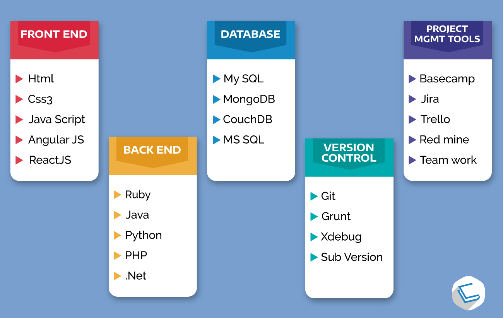

FULL STACK WEB DEVELOPMENT 

  

## **Overview**
This repo contains books, courses, websites, and nanodegrees that have helped me in my journey towards getting the back end AI models to life with front end user experiences. This is not my core competence but these resources have helped me hack some pretty OK frontend applications (atleast in my opinion :)). Organization of content helps me to document my learning experience along the way. If the organization of content helps someone else in their journey then even better. Individual learnings of each of the below sections are within their respective README files 

# **Table Of Contents**

### **Books**
* TBD
    1. [TBD]()
    2. [TBD]()
    3. [TBD]()
* TBD
    1. [TBD]()
    2. [TBD]()
* TBD
    1. [TBD]()
    2. [TBD]()
* TBD
    1. [TBD]()
    2. [TBD]()

### **Courses**
* HTML & CSS
    1. [Web scraping in python: Datacamp]()
    2. [Web development by doing: HTML/CSS: Udemy]()
* JavaScript
    1. [TBD]()
    2. [TBD]()
* Angular JS
    1. [TBD]()
    2. [TBD]()
* React JS
    1. [TBD]()
    2. [TBD]()
* Flask
    1. [TBD]()
    2. [TBD]()
* Django
    1. [TBD]()
    2. [TBD]()
* Tkinter
    1. [TBD]()
    2. [TBD]()
* Node.js
    1. [TBD]()
    2. [TBD]()
* TypeScript
    1. [TBD]()
    2. [TBD]()

### **Nanodegrees**
1. [Full stack web developer]()
2. [Front end web developer]()

